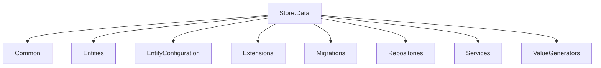

# Entity Framework Project Example

**This project is to implement a more real-world approach when
we try to create 7 configure a project that will use EF Core**

## Techniques used to highlight
- General Wrapper for various object responses
- Implementation of  Repository & UnitOfWork pattern
- Use of custom extension methods for easy customization
- Data & service configuration per class library pattern
- Implementation of class configuration apporach to convert into db table
- Implementation of custom dbContext class that allow us to add interceptors if needed or pre-set data from entities

## Solution Diagram - Store.Data

**This is where the entity configuration is located and will
help us to create specific entity configurations to each of our entities**

### Common Folder
This folder will contain helpers that will assist us when we try to manipulate data on the service layer

### Entities Folder
This is  where all the clases that represents an entity will be stored
there's also base classes & interfaces that will allow us to not duplicate code

### Entity Configuration Folder
Where we gonna create classes that extends from IEntityTypeConfiguration interface to
determine the specific configuration of a class that EF will take to convert it into a table on the database

### Extensions Folder
This folcer will contain all the extension class files that we're using inside this class library

### Migrations
This folder will contain all the migrations applied to the database, a core folder in the EF Core Configuration

### Repositories
This folder will contain interfaces & classes related to repositories used for this layer.

### Services
This folder will not contain services that is gonna be connected to the API itself. It's more
like an internal service only used as a part of our  real world example EF Core implementation

### Value Generatos
Another folder that will assint on the creation of automatic Id's for our entities once added into
the db context

### Necesary NuGet packages to install
- Microsoft.EntityFrameworkCore
- Microsoft.EntityFrameworkCore.Analyzers
- Microsoft.EntityFrameworkCore.SqlServer
- Microsoft.Extensions.Diagnostics.HealthChecks
- Microsoft.Extensions.Diagnostics.HealthChecks.EntityFrameworkCore